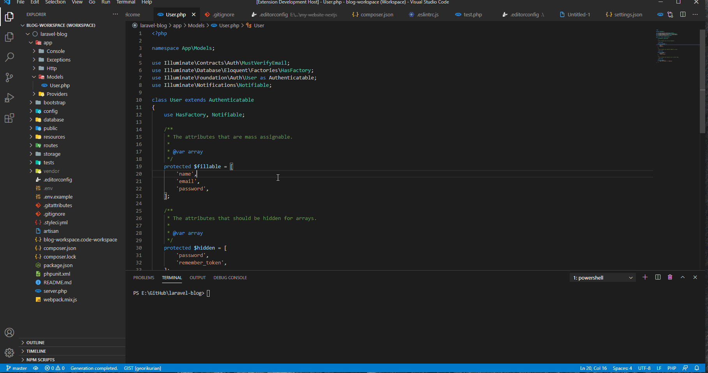

# Laravel Ide Helper (vs code)

Runs [laravel-ide-helper](https://github.com/barryvdh/laravel-ide-helper) commands in vs code.

This plugin helps generating helper files for better code suggestion for laravel.

## Features

- Improved Laravel code suggestion of `facades`.
- Improved Laravel code suggestion of `models`.
- Improved Laravel code suggestion of `macros`.


## Demo



## Usage

1. Install composer [laravel-ide-helper](https://github.com/barryvdh/laravel-ide-helper) package to the workspace

	``` bash
	composer require --dev barryvdh/laravel-ide-helper
	```
2. Save any .php file to generate `facade helper` files
3. Save any modal file to generate `model helper` files

> *Note: Need a working database connection for properly generating `model helper` files*


