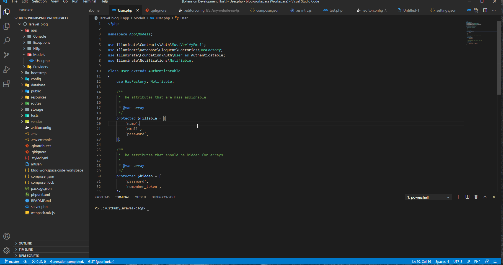

# Laravel IDE Helper (VS Code)

Runs [laravel-ide-helper](https://github.com/barryvdh/laravel-ide-helper) commands in VS Code.

This extension helps generate helper files for better code suggestions in Laravel projects.

## ✨ What's New in v2.0

- **⚡ 10x Faster** - Completely rewritten with modern build tools for lightning-fast performance
- **🚀 Parallel Execution** - Run multiple IDE helper commands simultaneously
- **⏱️ Smart Debouncing** - Configurable delays to prevent unnecessary runs
- **📦 90% Smaller** - Optimized bundle size for instant activation
- **🔧 Modern Codebase** - Updated to latest TypeScript, ESLint, and dependencies

## Features

* Improved Laravel code suggestions for **Facades**
* Improved Laravel code suggestions for **Models**
* Improved Laravel code suggestions for **Macros**
* Automatic Laravel project detection
* Progress indicators with cancellation support
* Configurable PHP path and run-on-save behavior
* **NEW:** Parallel command execution for faster performance
* **NEW:** Configurable debounce delay for file saves

## Demo



## Requirements

1. A Laravel project with the [laravel-ide-helper](https://github.com/barryvdh/laravel-ide-helper) package installed:

```bash
composer require --dev barryvdh/laravel-ide-helper
```

2. A working database connection (required for generating model helpers)

## Usage

### Automatic (Run on Save)

* Save any `.php` file in the `app` directory to generate **Facade helper** files
* Save any model file to generate **Model helper** files

### Manual Commands

Open the Command Palette ( `Ctrl+Shift+P` / `Cmd+Shift+P` ) and run:

| Command | Description |
|---------|-------------|
| `Laravel Helper: Run All Helpers` | Runs all enabled IDE helper commands |
| `Laravel Helper: Run Facade Helper` | Generates PHPDoc for Facades ( `ide-helper:generate` ) |
| `Laravel Helper: Run Model Helper` | Generates PHPDoc for Models ( `ide-helper:models` ) |
| `Laravel Helper: Run Meta Helper` | Generates meta file for IDE support ( `ide-helper:meta` ) |

## Settings

Configure the extension in your VS Code settings:

| Setting | Type | Default | Description |
|---------|------|---------|-------------|
| `helper.facades` | boolean | `true` | Enable Facade helper generation |
| `helper.models` | boolean | `true` | Enable Model helper generation |
| `helper.runOnSave` | boolean | `true` | Automatically run helpers when saving PHP files |
| `helper.autoClearConsole` | boolean | `false` | Clear output console before running commands |
| `helper.phpPath` | string | `"php"` | Path to PHP executable |
| `helper.debounceDelay` | number | `1000` | Delay in milliseconds before running commands after save (prevents multiple runs on rapid saves) |
| `helper.parallelExecution` | boolean | `true` | Run multiple commands in parallel for faster execution |

### Example Configuration

```json
{
  "helper.facades": true,
  "helper.models": true,
  "helper.runOnSave": true,
  "helper.autoClearConsole": false,
  "helper.phpPath": "/usr/local/bin/php",
  "helper.debounceDelay": 1000,
  "helper.parallelExecution": true
}
```

## Recommended Setup

Publish and customize the configuration for laravel-ide-helper for better results:

```bash
php artisan vendor:publish --provider="Barryvdh\LaravelIdeHelper\IdeHelperServiceProvider" --tag=config
```

## Performance Tips

### Optimize for Large Projects

For large Laravel projects, you can adjust these settings:

```json
{
  "helper.debounceDelay": 2000,
  "helper.parallelExecution": true
}
```

This gives you a 2-second delay before running commands, preventing unnecessary runs when saving multiple files quickly.

### Disable Run on Save

If you prefer manual control:

```json
{
  "helper.runOnSave": false
}
```

Then use the Command Palette commands when needed.

## Troubleshooting

* **"Not a Laravel project" warning**: Ensure your workspace contains an `artisan` file at the root
* **Model generation fails**: Check that your database connection is properly configured
* **PHP not found**: Set the `helper.phpPath` setting to your PHP executable path
* **Commands running too often**: Increase `helper.debounceDelay` to 2000 or higher
* **Slow performance**: Ensure `helper.parallelExecution` is enabled (default: true)

## Contributing

Contributions are welcome! Please feel free to submit a Pull Request.

1. Fork the repository
2. Create your feature branch (`git checkout -b feature/amazing-feature`)
3. Run tests (`npm test`)
4. Commit your changes (`git commit -m 'Add some amazing feature'`)
5. Push to the branch (`git push origin feature/amazing-feature`)
6. Open a Pull Request

## Changelog

See [CHANGELOG.md](changelog.md) for a list of changes.

## License

See [LICENSE.txt](LICENSE.txt)
